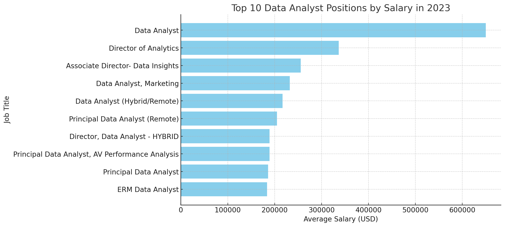
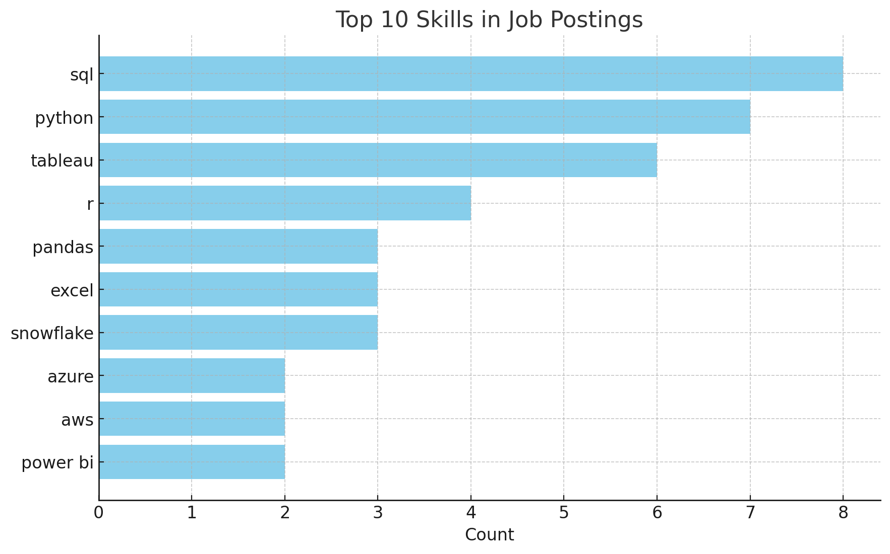
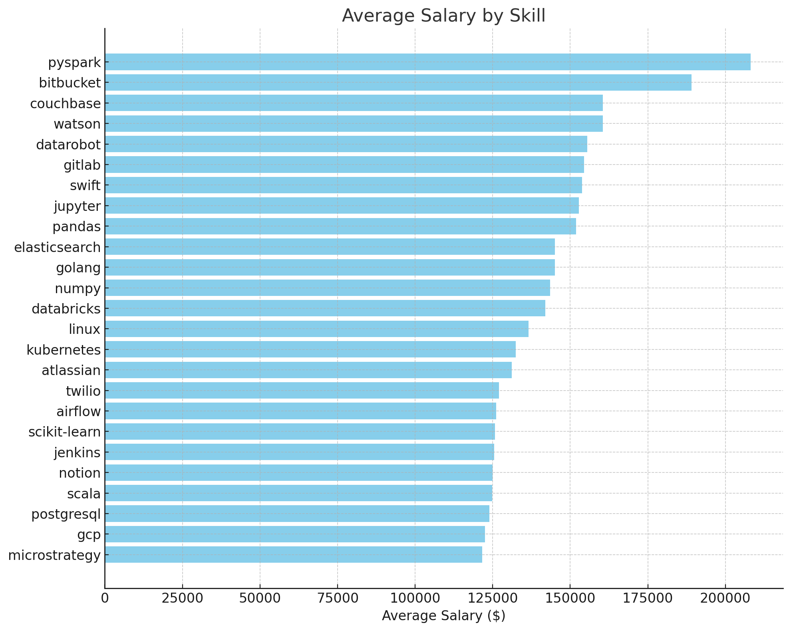
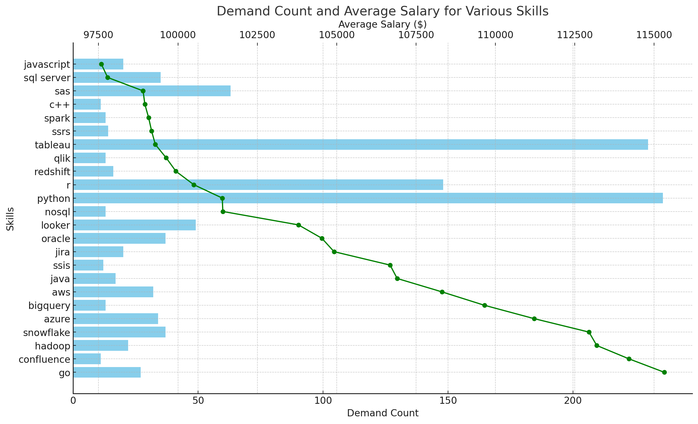

# Introduction
In 2023, the rapidly evolving field of data analytics continues to play a pivotal role in shaping industries and driving innovation. As organizations increasingly rely on data-driven insights to make informed decisions, the demand for skilled data professionals has surged. 

This project aims to explore the current landscape of job availability and pay scales within the data sector, providing a comprehensive analysis of trends, opportunities, and the factors influencing compensation across various roles. By examining data from diverse sources, this study seeks to offer valuable insights for both job seekers and employers navigating the competitive data job market.

SQL queries? Check them out here: [project_sql folder](/project_sql/)

# Background
My decision to undertake this project stems from a deep-seated interest in the intersection of data science and workforce dynamics. As a data professional, I have witnessed firsthand the growing importance of data-driven decision-making across various industries, as well as the increasing demand for skilled talent in this field. 

However, despite the booming job market, there is often a lack of transparency regarding job availability, required skills, and compensation trends. This project is driven by my desire to bridge this informational gap, offering clarity to both aspiring data professionals and employers alike. 

By analyzing the current state of the data job market, I aim to contribute to a more informed and equitable landscape, where individuals can make strategic career decisions and organizations can better understand the value of their data teams.

### Questions I am seeking to answer:
1. What are the highest paying data analyst jobs?
2. What skills are required for these top-paying jobs?
3. What skills are the most in demand for data analysts?
4. Which skills are associated with the industries highest salaries?
5. What are the most optimal skills sought after by the marketplace?

# Tools I Used
To successfully execute this project, I leveraged a combination of powerful tools that are integral to the field of data analytics. 

- **SQL** was employed to efficiently query and manipulate large datasets, ensuring that the analysis was both accurate and comprehensive. 
- For coding and development, I utilized **Visual Studio Code** (VSCode), a versatile and user-friendly editor that facilitated seamless script writing and debugging. 
- Version control was managed through **GitHub**, allowing for systematic tracking of changes, collaboration, and ensuring the integrity of the project's codebase. 
- Finally, **PostgreSQL** served as the backbone for data storage and management, providing a robust and scalable solution for handling complex data queries. 

These tools, when combined, enabled a smooth and efficient workflow, contributing to the project's overall success.

# The Analysis
Each query for this project aimed at investigating specific aspects of the data job market. Here is the approach I employed for each question:

### 1. Top Paying Data Analyst Jobs
To better identify data positions with the highest offered salaries, I chose to filter data analyst positions by average yearly salary and location, focusing on remote jobs. This query highlights the most lucrative opportunities within the current industry.

```sql
SELECT
    job_id,
    job_title,
    job_location,
    job_schedule_type,
    salary_year_avg,
    job_posted_date,
    name AS company_name
FROM
    job_postings_fact
LEFT JOIN
    company_dim ON job_postings_fact.company_id = company_dim.company_id
WHERE
    job_title_short = 'Data Analyst' AND
    job_location = 'Anywhere' AND
    salary_year_avg IS NOT NULL
ORDER BY
    salary_year_avg DESC
LIMIT 10;
```
Here is a brief breakdown of my findings:

- ***Diverse Salary Range***: The average annual salaries for data analyst roles vary significantly, ranging from $184,000 to $650,000. This wide range indicates that the term "data analyst" encompasses a broad spectrum of roles with varying levels of responsibility, expertise, and organizational impact. 

- ***Remote Work Prevalence***: All the top 10 positions are listed as available "Anywhere," suggesting a strong trend toward remote or hybrid work environments in the data analytics field. This flexibility in job location reflects the growing acceptance and demand for remote work options, allowing companies to attract talent from a broader geographic pool and giving data professionals more opportunities to work in varied environments.

- ***High Demand for Senior Roles***: Several positions in the top 10 are senior or director-level roles, such as the "Director of Analytics," "Associate Director- Data Insights," and multiple "Principal Data Analyst" positions. This trend highlights a high demand for experienced professionals who can lead analytics teams, provide strategic insights, and drive data-driven decision-making at the organizational level. 


*Bar graph vizualizing the top ten data positions based on average salary; ChatGPT generated this graph utilizing JSON code from query results*

### 2. Top Paying Job Skills
In the rapidly evolving field of data analytics, staying abreast of the most sought-after skills is crucial for multiple stakeholders, including job seekers, employers, and educators. For this section I chose to utilize Common Table Expersions (CTE's) and INNER JOINS to include all of the relavent data required to reach keen industry insights.

```sql
WITH top_paying_jobs AS (

    SELECT
        job_id,
        job_title,
        salary_year_avg,
        name AS company_name
    FROM
        job_postings_fact
    LEFT JOIN
        company_dim ON job_postings_fact.company_id = company_dim.company_id
    WHERE
        job_title_short = 'Data Analyst' AND
        job_location = 'Anywhere' AND
        salary_year_avg IS NOT NULL
    ORDER BY
        salary_year_avg DESC
    LIMIT 10
)

SELECT 
    top_paying_jobs.*,
    skills
FROM top_paying_jobs
INNER JOIN skills_job_dim ON top_paying_jobs.job_id = skills_job_dim.job_id
INNER JOIN skills_dim ON skills_job_dim.skill_id = skills_dim.skill_id
ORDER BY
    salary_year_avg DESC;
```
Here is a brief breakdown of my findings:

***Dominance of SQL and Python***: SQL and Python are foundational skills across various data roles, appearing in almost every job listing. This highlights the importance of these two technologies in managing, querying, and analyzing data. SQL's ubiquity in data retrieval and management, combined with Python's versatility in data analysis, machine learning, and automation, makes them indispensable for data professionals.

***Increasing Importance of Data Visualization Tools***: Tools like Tableau and Power BI are prominently featured in the top 10 skills. This reflects the growing demand for professionals who can not only analyze data but also present it effectively to stakeholders through visualization.

***Cloud Computing and Data Warehousing are Critical***: The inclusion of Azure, AWS, and Snowflake among the top skills indicates a significant shift towards cloud-based data storage and processing solutions. With the massive amounts of data generated today, cloud platforms provide scalable, flexible, and cost-effective solutions for data management.


*Bar graph vizualizing the frequency of the top 10 tools mentioned for data analysts; ChatGPT generated this graph utilizing JSON code from query results*

### 3. Demanded Skills
Knowing the top 5 skills sought after for data analysts is crucial because it directly informs your career development and competitiveness in the job market. It allows you to focus on acquiring or enhancing these key competencies—such as SQL, Excel, Python, Tableau, and Power BI—ensuring that you meet the core requirements for the majority of data analyst roles. I made sure to aggregate my job skills table by COUNT and INNER JOIN with the job postings table for the most relavent analysis.

```sql
SELECT
    skills,
    COUNT(skills_job_dim.job_id) AS demand_count
FROM
    job_postings_fact
INNER JOIN skills_job_dim ON
    job_postings_fact.job_id = skills_job_dim.job_id
INNER JOIN skills_dim ON
    skills_job_dim.skill_id = skills_dim.skill_id
WHERE
    job_title_short = 'Data Analyst' AND
    job_work_from_home = TRUE
GROUP BY
    skills
ORDER BY
    demand_count DESC
LIMIT 5;
```

After running my SQL query, the top 5 in-demand skills for data analysts are:

|  Skills  |  Demand Count  |
|----------|----------------|
| SQL	   | 7,291          |
| Excel	   | 4,611          |
| Python   | 4,330          |
| Tableau  | 3,745          |
| Power BI | 2,609          |


Here is a brief breakdown of my findings:

***SQL as the Foundation of Data Analysis***: SQL is the most in-demand skill with 7,291 mentions, indicating its critical role in the field of data analysis. This highlights that a strong understanding of SQL is essential for accessing and managing databases.

***Excel’s Enduring Relevance***: With 4,611 mentions, Excel remains a crucial tool despite the rise of more advanced software. Its widespread use in businesses of all sizes keeps it relevant for data analysts.

***Python’s Growing Importance in Data Analysis***: Comprehensive Data Analysis: Python, with 4,330 mentions, is recognized for its extensive libraries (like Pandas, NumPy, and SciPy) that simplify data manipulation, statistical analysis, and machine learning tasks.

### 4. Top Paying Skills
Understanding which data skills translate into higher salaries is obviously relevant to a job seeker given how it highlights specific skills that command high average salaries in the data market. Again, for this query I made sure to JOIN data from multiple tables to best include all the relavant information. I then chose to aggregate the annual salaries by their average (AVG) and made sure to round (ROUND) as well to eliminate unnecessary decimals.

```sql
SELECT
    skills,
    ROUND (AVG(salary_year_avg), 0) AS avg_salary
FROM
    job_postings_fact
INNER JOIN skills_job_dim ON
    job_postings_fact.job_id = skills_job_dim.job_id
INNER JOIN skills_dim ON
    skills_job_dim.skill_id = skills_dim.skill_id
WHERE
    job_title_short = 'Data Analyst' AND
    salary_year_avg IS NOT NULL
    AND job_work_from_home = TRUE
GROUP BY
    skills
ORDER BY
    avg_salary DESC
LIMIT 25;
```
Here is a brief breakdown of my findings:

***Big Data and Cloud Skills Lead Salaries***: Expertise in big data processing 
tools like PySpark and Databricks, along with cloud platforms like GCP, 
commands the highest salaries for data analysts. Mastery of these technologies 
is critical for handling large-scale data operations.

***Versatility Across Tools is Highly Valued***: Proficiency in a diverse set of 
tools—ranging from version control (e.g., GitLab, Bitbucket) to data manipulation
libraries (e.g., Pandas, Numpy) and workflow management (e.g., Airflow)—is crucial. 
This versatility allows data analysts to integrate well with broader software 
development and data engineering processes, leading to higher pay.

***Specialized Technologies in AI and Databases***: Skills in specialized tools for 
AI, automated machine learning (e.g., Watson, DataRobot), and both NoSQL and 
relational databases (e.g., Couchbase, PostgreSQL) are also among the top-paying. 
These skills highlight a strong demand for data analysts who can manage complex 
data environments and deliver advanced analytics.


*Bar graph vizualizing the top 25 salaries based upon specific skills; ChatGPT generated this graph utilizing JSON code from query results*

### 5. Optimal Skills
For this query I chose to focus on high demand skills associated with high average salaries and then filter them based on those that were available remotely. This targets skills that offer job security (high demand) and financial benefits (high salaries) while also offering strategic insights for career development in data analysis.

```sql
WITH skills_demand AS (
    SELECT
        skills_dim.skill_id,
        skills_dim.skills,
        COUNT(skills_job_dim.job_id) AS demand_count
    FROM
        job_postings_fact
    INNER JOIN skills_job_dim ON
        job_postings_fact.job_id = skills_job_dim.job_id
    INNER JOIN skills_dim ON
        skills_job_dim.skill_id = skills_dim.skill_id
    WHERE
        job_title_short = 'Data Analyst' AND
        salary_year_avg IS NOT NULL AND
        job_work_from_home = TRUE
    GROUP BY
        skills_dim.skill_id
)

, average_salary AS (
    SELECT
        skills_job_dim.skill_id,
        ROUND(AVG(job_postings_fact.salary_year_avg), 0) AS avg_salary
    FROM
        job_postings_fact
    INNER JOIN skills_job_dim ON
        job_postings_fact.job_id = skills_job_dim.job_id
    INNER JOIN skills_dim ON
        skills_job_dim.skill_id = skills_dim.skill_id
    WHERE
        job_title_short = 'Data Analyst' AND
        salary_year_avg IS NOT NULL
        AND job_work_from_home = TRUE
    GROUP BY
        skills_job_dim.skill_id
)

SELECT
    skills_demand.skill_id,
    skills_demand.skills,
    demand_count,
    avg_salary
FROM
    skills_demand
INNER JOIN average_salary ON skills_demand.skill_id = average_salary.skill_id
WHERE
    demand_count > 10
ORDER BY
    avg_salary DESC,
    demand_count DESC
LIMIT 25;


-- Rewrite of the previous query to be more concise


SELECT
    skills_dim.skill_id,
    skills_dim.skills,
    COUNT(skills_job_dim.job_id) AS demand_count,
    ROUND(AVG(job_postings_fact.salary_year_avg), 0) AS avg_salary
FROM
    job_postings_fact
INNER JOIN skills_job_dim ON
    job_postings_fact.job_id = skills_job_dim.job_id
INNER JOIN skills_dim ON
    skills_job_dim.skill_id = skills_dim.skill_id
WHERE
    job_title_short = 'Data Analyst'
    AND salary_year_avg IS NOT NULL
    AND job_work_from_home = TRUE
GROUP BY
    skills_dim.skill_id
HAVING
    COUNT(skills_job_dim.job_id) > 10
ORDER BY
    avg_salary DESC,
    demand_count DESC
LIMIT 25;
```
Here is a brief breakdown of my findings:

***High Demand for Python and Tableau***: Python and Tableau are the most in-demand skills. However, despite their high demand, their average salaries are relatively lower at $101,397 and $99,288, respectively, indicating a possible oversupply of professionals with these skills or that these are entry-level or widely adopted tools in the industry.

***Specialized Skills Command Higher Salaries***: Skills such as Go, Confluence, and Hadoop, while not as widely demanded, command higher average salaries above $113,000. This suggests that these specialized skills are highly valued and might be harder to find in the job market, leading to higher compensation for professionals who possess them.

***Balance of Demand and Salary in Cloud-Related Skills***: Skills like Snowflake, Azure, and AWS show a balance between demand and salary. Snowflake has a demand count of 37 with an average salary of $112,948, Azure has 34 with $111,225, and AWS has 32 with $108,317. This indicates that cloud-related skills are both in demand and well-compensated, reflecting the industry's growing reliance on cloud technologies.


*This visualization highlights both the demand count and average salary for various skills. The bar chart represents the demand count, while the line chart indicates the average salary for each skill. This dual representation allows you to see not only which skills are in high demand but also how they compare in terms of compensation.​*

# What I Learned

Deciding to embark upon this analytical endeavor I've successfully integrated advanved SQL querying within my data analytical toolbelt:

***Basic SQL Keywords***: Acheived a thorough understanding of essential SQL commands such as SELECT, FROM, WHERE, GROUP BY, ORDER BY, and LIMIT. These are the building blocks for writing queries that retrieve, filter, and organize data effectively.

***Aggregation Functions***: Became proficient in using aggregation functions like SUM(), COUNT(), AVG(), MAX(), and MIN() to perform calculations within datasets. These functions allow me to summarize large volumes of data and extract meaningful insights.

***JOINing Tables***: Mastered the ability to combine data from multiple tables using JOIN operations, including INNER JOIN, LEFT JOIN, RIGHT JOIN, and FULL OUTER JOIN. This skill is essential for working with complex databases and performing comprehensive analyses.

***Subqueries & CTEs***: Developed my ability to leverage subqueries and Common Table Expressions (CTEs) to break down complex queries into more manageable parts. This enables me to write more efficient and readable SQL code, often improving performance and clarity.

# Conclusions

### Insights

- ***Diverse Salary Range***: The average annual salaries for data analyst roles vary significantly, ranging from $184,000 to $650,000. This wide range indicates that the term "data analyst" encompasses a broad spectrum of roles with varying levels of responsibility, expertise, and organizational impact.

- ***Dominance of SQL and Python***: SQL and Python are foundational skills across various data roles, appearing in almost every job listing. This highlights the importance of these two technologies in managing, querying, and analyzing data. SQL's ubiquity in data retrieval and management, combined with Python's versatility in data analysis, machine learning, and automation, makes them indispensable for data professionals.

- ***SQL as the Foundation of Data Analysis***: SQL is the most in-demand skill with 7,291 mentions, indicating its critical role in the field of data analysis. This highlights that a strong understanding of SQL is essential for accessing and managing databases.

- ***Versatility Across Tools is Highly Valued***: Proficiency in a diverse set of tools—ranging from version control (e.g., GitLab, Bitbucket) to data manipulation
libraries (e.g., Pandas, Numpy) and workflow management (e.g., Airflow)—is crucial. This versatility allows data analysts to integrate well with broader software 
development and data engineering processes, leading to higher pay.

- ***High Demand for Python and Tableau***: Python and Tableau are the most in-demand skills. However, despite their high demand, their average salaries are relatively lower at $101,397 and $99,288, respectively, indicating a possible oversupply of professionals with these skills or that these are entry-level or widely adopted tools in the industry.

### Closing Thoughts
This project significantly improved my SQL skills and offered valuable insights into the data analyst job market. The analysis results serve as a strategic guide for prioritizing skill development and job search efforts. By concentrating on high-demand, high-paying skills, aspiring data analysts can better position themselves in a competitive job landscape. This exploration also underscored the importance of continuous learning and staying adaptable to emerging technologies within the feild of data analytics.